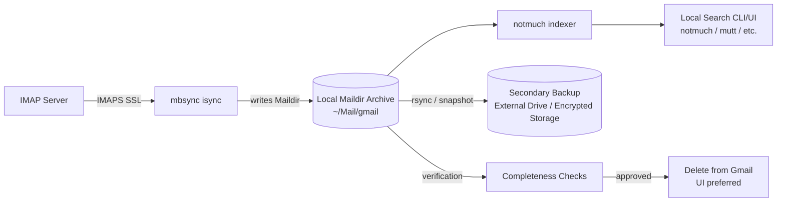

## 1. Purpose

This document specifies requirements and a technical solution for exporting all emails from an **IMAP account** (Gmail included) to local storage on Linux, deleting them from the remote server after verification, and retaining the ability to index and search the archive locally without vendor lock-in.

The solution must be resilient to interruptions and support resumable synchronization.

---

## 2. Scope

### In Scope
- IMAP mailbox export to local Linux filesystem
- Standardized, non-proprietary storage format
- Deduplicated local storage
- Checkpointing and resumable downloads
- Full-text indexing and search of the archive
- Deletion of mail from the IMAP server after archive verification
- Repeatable operation (ability to rerun sync for incremental updates)
- Compression to minimize cold storage consumption

### Out of Scope
- Preserving provider-specific label semantics as folders locally (e.g. Gmail labels)
- Real-time two-way sync as a primary mail client
- GUI mail client configuration (optional)
- Legal retention policy definition (assumed provided by the organization/user)

---

## 3. Requirements

### 3.1 Functional Requirements (FR)

**FR-1: Export all emails from an IMAP account to local storage**  
The solution must download all emails stored in the IMAP account.

**FR-2: Deduplicated storage**  
Each unique email message must be stored only once locally (no duplicates across folders/labels).

**FR-3: Standardized portable format**  
Exported mail must be stored in an open, standardized format suitable for long-term archival and migration.

**FR-4: Resumable transfer with checkpoints**  
If the export process is interrupted (network failure, reboot, power loss), the process must resume without restarting from scratch.

**FR-5: Local full-text search**  
The user must be able to search message headers and bodies locally after deletion from the remote server.

**FR-6: Attachment retention**  
All attachments must be preserved with the messages.

**FR-7: Integrity verification prior to deletion**  
The solution must support verification that export is complete before server-side deletion.

**FR-8: Server-side deletion after backup**  
After verification, the user must be able to delete emails from the IMAP server while keeping the local archive.

**FR-9: Incremental reruns**  
The solution must support rerunning exports to capture new mail without re-downloading everything.

**FR-10: Cold storage compression**  
The solution should compress all archives before storage.

---

### 3.2 Non-Functional Requirements (NFR)

**NFR-1: Vendor lock-in avoidance**  
The archive must remain usable without the IMAP provider’s tools or proprietary formats.

**NFR-2: Reliability**  
Export must tolerate long runtimes and intermittent connectivity.

**NFR-3: Performance**  
Search must be fast on commodity Linux hardware for large mailboxes.

**NFR-4: Maintainability**  
The solution must use common, well-supported Linux tools.

**NFR-5: Security**  
Credentials must not be stored in plaintext with world-readable permissions. Transport must be encrypted.

**NFR-6: Portability**  
Archive should be portable to other systems and other mail tooling.

**NFR-7: Auditability**  
The process should be transparent and scriptable (CLI-first).

---

## 4. IMAP Provider Model Considerations

### 4.1 Generic IMAP considerations
Most IMAP servers store messages within folders; which folders you sync is a user choice. Some servers may copy the same message into multiple folders (or expose tags/labels as folders), which can create duplicates depending on provider semantics.

### 4.2 Gmail-specific model considerations

Gmail stores a message once and applies one or more **labels** (e.g., INBOX, Sent, custom labels). Gmail exposes these labels as IMAP folders.

Important consequences:

- `[Gmail]/All Mail` is the canonical view of mail (includes sent/received/archived).
- **INBOX is just a label**; messages in INBOX also appear in All Mail.
- **IMAP clients treat folders as separate mailboxes**, which can cause duplicate downloads if multiple Gmail folders are synced.

To satisfy deduplication requirements, the solution must avoid syncing multiple Gmail IMAP folders that reference the same underlying message.

---

## 5. Proposed Solutions

### Option A (Recommended): IMAP → Maildir via mbsync + notmuch indexing

#### Summary
Use IMAP to sync an IMAP account to a local **Maildir** store using `mbsync` (from `isync`), then index with `notmuch`.

For Gmail, apply the Gmail-specific folder selection rules below to prevent duplicates.

Folder selection is provider-dependent:

Gmail profile (recommended to prevent duplication):
- `[Gmail]/All Mail` (primary archive)
- `[Gmail]/Drafts` (recommended)
- `[Gmail]/Spam` (optional, for completeness)
- `[Gmail]/Trash` (optional, for completeness)

Other IMAP providers:
- Sync a user-configured list of canonical folders (often `INBOX`, `Sent`, `Archive`), based on how the provider stores messages.

#### Why it satisfies requirements
- Maildir is standardized and portable.
- `mbsync` provides checkpoint/resume behavior.
- Deduplication is achieved by syncing only All Mail (and truly separate special folders).
- `notmuch` provides fast local full-text search.

#### Trade-offs
- Gmail labels are not preserved as folders (by design, to enforce dedupe).
- Attachment *content indexing* requires extra tooling if desired (message storage is preserved regardless).

---

### Option B: Gmail Takeout → MBOX → Convert to Maildir + notmuch

#### Summary
Use Google Takeout to export email as MBOX, then convert to Maildir for indexing.

#### Pros
- Export is not IMAP-dependent.
- Labels can be preserved as metadata headers.
- Generally deduplicated by Gmail.

#### Cons
- Not naturally resumable in the same “checkpointed sync” sense.
- Takeout exports are operationally heavy and not incremental.
- MBOX is more fragile (large monolithic files).

---

### Option C: IMAP full sync of all labels + post-deduplication

#### Summary
Sync all IMAP folders/labels and run a dedupe process locally (e.g., by Message-ID + hash).

#### Pros
- Preserves labels as folders.

#### Cons
- High complexity.
- Fragile for incremental sync (duplicates can reappear).
- Difficult to maintain a single canonical copy without building a label database.

---

## 6. Selected Approach

**Option A is selected** because it best satisfies the requirements:

- Strong deduplication
- Resumable checkpointed export
- Standard formats
- Excellent local search performance
- Repeatable incremental operation

---

## 7. High-Level Architecture

### Components
- **IMAP Server**: Source system
- **mbsync (isync)**: Resumable IMAP-to-Maildir synchronization engine
- **Maildir Store (filesystem)**: Canonical local archive
- **notmuch**: Indexer and search engine
- **Backup Copy (external disk / encrypted storage)**: Secondary redundancy
- **Deletion Workflow (Gmail UI or IMAP)**: Post-verification cleanup

---

## 8. Architecture Diagram (Mermaid)

---

## 9. Detailed Design

### 9.1 Storage Format

**Maildir** is selected because:
- Each message is stored as a separate file (low corruption blast radius).
- Works well with Unix tools and backups.
- Compatible with multiple clients and indexers.

---

### 9.2 Synchronization Method

**mbsync** provides:
- Incremental sync
- Persistent sync state (checkpointing)
- Safe re-runs after interruption

Resumability is achieved because mbsync:
- Tracks what has already been downloaded
- Avoids re-downloading completed items on subsequent runs

---

### 9.3 Folder Selection Strategy (Deduplication)

To enforce deduplication:

- Sync `[Gmail]/All Mail` as the canonical message set.
- Do **not** sync `INBOX` or custom label folders.
- Optionally sync Drafts/Spam/Trash if required for completeness.

Rationale:
- Messages in INBOX are also in All Mail.
- Custom labels map to IMAP folders, which will duplicate messages already in All Mail.

---

### 9.4 Indexing and Search

`notmuch` is selected because:
- Very fast indexing and search at scale
- Works directly against Maildir
- Uses Xapian for robust full-text search

Minimum search requirements met:
- Search by sender, recipient, subject, date, body text.

Optional extension:
- Attachment text indexing (requires external extractors and configuration).

---

## 10. Operational Workflow

### Phase 1: Initial Export
1. Configure IMAP access (provider-specific; Gmail often uses an app password or OAuth2).
2. Run `mbsync` for initial sync.
3. Rerun until it completes cleanly.

### Phase 2: Index
1. Initialize notmuch configuration.
2. Run `notmuch new`.

### Phase 3: Verification
1. Spot-check message counts and date ranges.
2. Confirm search works.
3. Confirm attachments exist.

### Phase 4: Secondary Backup
1. Copy Maildir archive to external or encrypted storage.

### Phase 5: Server Deletion
1. Delete mail from the remote server (provider UI preferred for safety).
2. Empty Trash (after confirmation).

### Phase 6: Incremental Updates (if desired)
1. Periodically run `mbsync` again to capture new mail prior to deletion cycles.

---

## 11. Security Considerations

- IMAP transport must use TLS (`IMAPS`).
- Credentials must be stored in permission-restricted files (`chmod 600`).
- Prefer Gmail App Passwords (if 2FA enabled).
- Consider encrypting the local archive volume if the device is portable.

---

## 12. Risks and Mitigations

### Risk: Duplicate downloads
**Mitigation:** Sync only `[Gmail]/All Mail` (+ special folders). Do not sync labels.

### Risk: Incomplete export
**Mitigation:** Multi-step verification + secondary backup before deletion.

### Risk: Drafts not captured
**Mitigation:** Sync `[Gmail]/Drafts` explicitly if drafts must be retained.

### Risk: Long initial runtime
**Mitigation:** Resumable sync, run repeatedly until completion.

### Risk: Accidental deletion before verification
**Mitigation:** Enforce workflow ordering; deletion only after checks + backup.

---

## 13. Acceptance Criteria

The solution is accepted when:

1. All messages in the IMAP account are present locally in Maildir form.
2. Duplicates are avoided according to provider semantics (Gmail profile: single canonical message storage).
3. The sync process can be interrupted and resumed without restarting.
4. Local full-text search works after remote mail is deleted.
5. A secondary backup exists before deletion.
6. The IMAP mailbox can be deleted without losing access to the archive.

---

## 14. Appendix: Reference Tooling (Linux)

- **isync / mbsync**: IMAP synchronization to Maildir
- **notmuch**: Indexing and search
- **rsync / borg / restic**: Secondary backups (recommended)

---

## 15. Orchestration and Automation

This project is intended to be **repeatable and safe-by-default**. Orchestration should ensure:
- Sync and indexing can be run unattended.
- Deletion is **gated** behind explicit verification.
- Credentials are handled via OS tooling (not committed to the repo).

### 15.1 Recommended Orchestration Model

Use a small CLI wrapper (provided by this repo) to orchestrate the underlying tools (`mbsync`, `notmuch`, and the selected backup tool), and optionally schedule it via a `systemd --user` timer.

Typical operations:
1. `sync`: run `mbsync` against the canonical channels
2. `index`: run `notmuch new`
3. `verify`: run completeness checks and produce a signed/recorded verification artifact
4. `backup`: run restic/borg/rsync snapshot
5. `delete`: intentionally **not fully automated**; deletion should be a separate, explicit action (often via Gmail UI)

### 15.2 Scheduling (systemd user units)

A safe default is:
- A `sync` timer that runs periodically (e.g. hourly/daily) for incremental archiving.
- An `index` step that runs immediately after sync (in the same service invocation).

The timer should run as a user unit (no root) and write logs to journald.

### 15.3 Credential Handling

Do not store secrets in the repo.

Recommended patterns:
- Store the IMAP password in a secret manager (e.g. `pass`).
- Configure `mbsync` to use `PassCmd` (or an equivalent command) to fetch the password at runtime.
- Ensure config files containing sensitive fields are `chmod 600`.
- Gmail note: when 2FA is enabled, an **App Password** is commonly used.

### 15.4 Verification Gate (before deletion)

At minimum, verification should:
- Confirm `mbsync` reports a clean sync and no outstanding changes.
- Confirm `notmuch` can search expected messages.
- Confirm date range coverage (oldest/newest messages) and rough counts.
- Produce a local “verification report” saved alongside the archive (so deletion decisions are auditable).

Only after verification **and** a successful secondary backup should deletion from Gmail occur.

---

## 16. Operational Runbook (Commands)

These commands are illustrative; the repo should provide a single entrypoint that wraps them.

### 16.1 Initial one-time setup
1. Enable IMAP in your provider’s settings (Gmail: enable IMAP in Gmail settings).
2. Create a local Maildir root (e.g. `~/Mail/gmail`).
3. Configure `mbsync` to sync only `[Gmail]/All Mail` (+ optional Drafts/Spam/Trash).
4. Initialize notmuch pointing at the Maildir root.

### 16.2 Routine operation
- Run sync + index:
  - `mbsync -a` (or a named group)
  - `notmuch new`
- Verify:
  - Compare message counts (Gmail UI vs `notmuch count '*'`), and spot-check searches.
- Backup:
  - Run restic/borg/rsync snapshot to secondary storage.

### 16.3 Deletion
Deletion is intentionally separate.
- Prefer Gmail UI for the initial delete to reduce the chance of script mistakes.
- Only empty Trash after a final sanity check.

---

## 17. Repository Deliverables (What this project should produce)

- A CLI wrapper to run `sync`, `index`, `verify`, and `backup` consistently.
- Templates/examples for:
  - `mbsync` configuration
  - `notmuch` configuration
  - `systemd --user` service + timer units
- A verification report format and a place to store verification artifacts.
- Documentation for:
  - initial setup
  - day-2 operations
  - safe deletion workflow
